# java-beginner

           
UNE VARIABLE: est un conteneur qui permet de stocker des donnees en memoire pour uneutilisation ulterieure dans un programme.

    elle est caracterisee par: un nom, un type,une valeur
    exemple: nom: masse  type:nombredecimal   valeur: 23,5kg

    si la variable est longue et elle doit etre lisible par des humains: si le nom de la variableest longue on utilise la notation CamelCase : exemple(totalAnnuelDesVentes)
    si la variable est tres longue on utilise la notation Snake_Cmel_Case: exemple(prix_Unitaire_Par_Produit_De_Reference)

    les types de variables en java sont: les types primitifs:
    byte(entier: -128....127) ; short(entier: -32768...32767) ; int(entier positif:0 ...4294967295 ) ; long(entier positif: 0...2^64-1)
    float(nbre decimal avec virgule et a 7 chiffres) ; double(nbre decimal avec virgule et a +7 chiffres) ; boolean(true ou false)  ; char (un caratere: a,$,4...)

    les types d'encapsulation:
    Integer(encapsule le type primitif); Double(encapsule le type primitif double:resp long) ; Boolean(encapsule le type primitif boolean) ; String(plusieurs chaines de caracteres

LES CONSTANTES : sont des valeus qui ne changent JAMAIS  (exemple: nbre de mois de annee: 12; nbre etages du batiment:3).
		 
	unboxing: prendre une variable qui est un type qui est encapsulant pour la transforme en une variable de type encapsule.
	autoboxing: est tprendre une variable de type encapsule pour la transforme en une variable de type qui est encapsulant.
	
	
RESUME SUR LES VARIABLES:
	
	-nombre entiers(mot-cle int);
	-nombres decimaux (mots cles float et double);
	-chaines de caracteres(mot cle String);
	-effectuer operations numeriques sur des nombres du meme type;
	-sur des types differents, CAST a la ressource;
	-utiliser de preference les types primitifs pour eviter de l'autoboxing et de l'unboxing inutile;
	-mettre les chaines de bout en bout grace a la CONCATENATION.
la CONCATENATION: signifie mettre bout à bout des chaînes de caractères, ce qui donne une chaîne de caractères
	
	
La fonction principale de la fonction principale un programme JAVA:
	
	     - un programme est compose de plusieurs fonctions(est un ensemble de taches qu'une personne ou un object est censer faire)
		  -chaque fonction reslise une taches specifique dans le programme
		  -elles ont un nom
		  -et sont executees lorsqu'elles sont mentionnees par leur noms dans d'autres fonction
		  -il faut donc une fonction principale, declenchee en premier
		  -en java il s'agit de main 
		  
LES FONCTIONS en java, sont logees dans les classes; une classe a des proprietes(attributs) et des fonctions(methodes ou comportemments)
	les classes sont logees dans des packages

COMMANDES:
	  
javac src/com/zerofiltre/parkinfbot/ParkingBot.java: pour compiler\demarrer un programme.
	  
java --class-path src com.zerofiltre.parkingbot.ParkingBot Ebeno : pour executer un fichier .class avec pour argument Ebeno.

    selectionner le bout de code a extrere et taper: Ctrl+Alt+M (pour extrere un bout de code dans une fonction ou METHODE ou comportement);
     Ctrl+Alt+V (pour extrere UNE VARIABLE); Ctrl+Alt+C (pour extrere UNE CONSTANTE); Ctrl+Alt+P (pour extrere UN PARAMETRE).                                         
    commentaire pour pouvoir generer de la documentataion officielle : /** taper entrer puis commenter.
    se placer sur la ligne de code que vous vouler dupliquer et taper: Ctrl+D (pour dupliquer une ligne de code).

RESUME SUR LES FONCTIONS :

	 UN PROGRAMME JAVA a au dessus de sa structure des packages(dossiers) qui contiennent des classes(fichiers) qui contiennent des fontions(methodes) qui constituent le comportement de nos classes.
	  (/**Commentaire*/)generer de la Javadoc a generer en HTML.
	  aucune logique dans la methode main : donc il faut toujours renommer le methode en mettant en nom qui sera comprehensible par tout developpeur.

LA PROGRAMMATION ORIENTE OBJET:  NOTION DE CLASSES, OBJETS,ATTRIBUTS

    La POO c'est quoi?
        Une variable c'est une combinaison de valeur,de nom et de type. parfois une variable ne suffit pas:
     exemple: Compte sur une application de rencontre 
       Nom:String, age:int, genre:String, mot de passe:String, taille: float ...
    ca en fait beaucoup des variables et de types!
     Creer un grand type COMPTE(nom,age,genre,...) rend la vie facile!
     C'est la PROGRAMMATION ORIENTEE OBJET
  

LA PORTEE DES VARIABLES: est son perimetre d'acces(accessibilite): est la zone ou la variable a ete declaree

       une variable est DECLAREES et ACCESSIBLE dans un contexte bien precis.
    exemple: un carton dans une chambre ne peut etre accessible depuis les autre pieces de la maison. il faut avoir les cles pour avoir acces a la variable(carton).
    
    on a: 
    la PORTEE GLOBALE:elle peut etre accessible dans toutes les methodes de la classe;dans tous les sous-blocs de code la zone.
    exemple: une variable(tele) qui est declare au salon peut etre utiliser dans la chambre et dans autre pieces de la maison.
    
    la PORTEE LOCALE: elle est uniquement accessible dans la methode qui l'a declare; dans le seul bloc de code de la zone.
    exemple: une variable(fer a repasse) qui est declare dans la chambre,ne peut etre utiliser dans d'autres pieces de la maison (pour l'utiliser il faut etre dans la chambre).

    une variable est aussi caracterise par un NIVEAU D'ACCES.
    exemple: ma maison a un salon et deux chambres, une personne exterieure peut acceder au que si elle a la cle du salon sans avoir la cle des chambres; un autre niveau d'acces cette meme personne peut acceder a une des chambres ssi on lui donne la cle de cette chambre.

    le niveau d'acces limite ou etend l'accessibilite grace a des mots cles a savoir:
    PUBLIC: c-a-d la variable peut etre visible par tous autre classe qui se situe dans le projet java ou a exterieur du dit projet.
    PROTECTED: c-a-d la variable peut etre accessible par ces 3 situations[depuis la classe qui a declarer la variable,depuis les classes et sous-classes(sous-classe :est une classe fille qui herite de tout les proprietes d'une classe mere.)de la classe declarente qui se situe dans le meme packaque que la classe declarente,les sous classes de la classe declarente qui se situe dans un autre package].
    PACKAGE-PROTECTED:lorsq'une variable est declaree ainsi ce qui est parametres par defaut: visible uniquement pour la classe declarante : ce cas est effectue quand on ne mets pas de niveau d'acces au niveau de la variable.
    PRIVATE: c-a-d la variable sera accessible uniquement a l'interieur de la classe declarante.
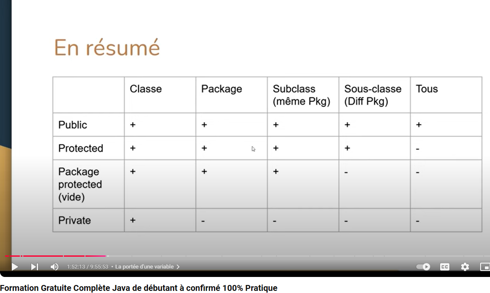

ILLUSTRATION DES NOTIONS DE VARIABLE GLOBALE ET LOCALES:

    completion: est une variable globale, parce qu'elle est utilisee dans les methodes sayHello et sayBay.
    welcomeMessage: est une variable locale ,parce qu'elle est utiliser dans la methode sayHello et ne peut etre utiliser dans d'autres methodes(exple: la methode sayBay).

UTILISATION DES BOUCLES:

    une boucle permet de repeter une instruction ou un ensemble d'instruction un nombre connu ou inconnu de fois.
Les types de boucles sont:

DENOMBREMENT: for:

    (elles sont utilisees lorsqu'on connais a l'avance combien de fois l'on veut effectuer la boucle)
                   exemple:Sauter a 5 reprises; Ajouter 2 points en plus a la note de chaque eleves.
        UNE ITERATION: est une repetition d'un bloc de code dans une boucle
     les boucles for: syntaxe
          for (initialisation; terminaison; incrementation)
           {
               // liste d'operations sur l'element traite
            }
illustration:exemple

           for (int i=0; i<5; i++){
                System.out.println("Je saute!");
            }

      Les boucles for: Syntaxe avancee
           for (element traite: collection d'elements){
                  //liste d'operations sur l'element traite
             }
        Exemple:
              for (Eleve eleve:tableauDesEleves) {
                    eleve.points += 2 ;
               }

Les boucles conditionnelles: while  | do ... while

    (elles sont utilisees losqu'on ne sait a l'avance combien de fois l'on veut effectuer la boucle)
         exemple: faire entrer les eleves jusqu'a ce que la salle soit pleine.

     la boucle while: Syntaxe	

         while(les conditions d'arret ou expression booleen ou logique){
                //operation tant que l'expression logique est vraie
          }

     si l'expression logique est fausse d'entree de jeu  alors on opere aucune fois c-a-d on entree jamais dans la boucle. 
        exemple:   while( salle.size>0){
                        ajouterEleve();
                      }

     la boucle do ... while: Syntaxe	

        do{
            // operer tant que l'expression logique est vraie
         }while(expresssionLogique)

     ici on opere au moins deux fois
     exemple:      int noombreSaut = 5;
                    do{
                      System.Out.Println("sauter");
                       nombresaut-1;
                     }while(nonmbreSaut > 0	)

Pour commenter un code taper: Ctrl+/ (il commente le code ligne par ligne)
                              Ctrl+Shift+/ (il commente le code par bloc)

LA PROGRAMMATION ORIENTEE OBJET: LA NOTION  OBJETS, ATTRIBUTS, CLASSES! 

    La POO c'est quoi? 
       Une variable: est une combinaison de valeur, de nom et de type. 
         parfois une variable ne suffit pas: 
             exemple: Compte sur une application de rencontre ou on a: Nom:String, age:int, genre:String, mot de passe:String, taille:float`... 
                    ca en fait beaucoup des variables et de type! la resolution est de creer un grand type COMPTE(nom,age,genre,...)rend la vie facile!
    C'est ca la PROGRAMMATION ORIENTEE OBJET.

 Notion OBJET:

    Un OBJET en programmation : represente un objet du monde reel.
        exemple: voiture,table,compte bancaire,smartphone...etc
      un OBJET represente un ensemble communs d'attributs.
         exemple: Compte bancaire| iban,bic,solde...
                  Voiture|Marque,couleur,puissance...
                  Compte|nom,taille,genre,age...
    Manipuler des objets implique concevoir UNE CLASSE!

Notion CLASSE:

     Une CLASSE est un grand type; elle est l'ebauche de l'objet; elle regroupe toutes les variables  de l'objet dans un seul type.
        les variables d'une classe sont des attributs!
            classe                  Compte
            attribut 1              Nom:String
            attribut 2              Age:int
            attributb 3             Genre:Strring

Attention : une classe ne detient pas seulement des variables mais aussi des comportements! au final:
Une classe= variables(attributs) + comportements(methodes/fonctions/traitement)
   
    exemple:
     class Compte{
         private string name;
          private string gender;           //attributs
          private int;                      
        ...
          //comportements
     }
Alerte: le niveau d'acces private renforce la notion d'encapsulation(pilie de la poo qui veut que les attributs d'une classe puissent etre acceder et modifier uniquement a l'interieur de la classe qui les ont declarres; d'ou le besoin de COMPORTEMENT.)

UN COMPORTEMENT:est ecris de la sorte

     class Compte{
          //suite
          public String getName(){
                 return this.name;                 
          }                                          //comportements accesseurs:recuperations et modifications des attributs
          public void setName(String newName){
                this.name= newName;
          }
     }

les types de retour represente les types de la valeur qui est retournee par le comportement/traitement
This :reference la classe dans laquelle on se trouve.

      class Compte{
          //suite
          public void connet(String email, String password){
             //connexion ...  
          }                                        //omportements de calcul:comportement logique de l'objet fait a l'aide de ses attibuts et des variables externes
          public void disconnect(){
              //deconnexion ...
          }
     }

    Comportements dit de logique:permet d'implementer le comportement de ses objets dans la vie reelle.
    un Comportement a la structure suivante:  

           [Niveasu d'acces]  [type de retour]  [nom([paremetres])]{
            return [resultat du traitement]
             }
         attention: Si aucun resultat de traitement, le type de retour est void et le mot cle return n'est pas mentionne.
                       return= Retourner une valeur comme resultat de traitement

En programmation on a deux types de classes:

     1- Classes de donnees/Modele de donnees:    on uniquement des attributs et des accesseurs.
     2- Classes de logique ou de calcul:    ne peut avoir attributs ni accesseurs mais a un comportements logiques.
           exemple: Classe principale d'un programme JAVA

      la structure de la classe de donnees est represente comme suite:
          Class Voiture {
                  private String model;

                  public String getModel(){return this.model}
                  public void setModel(String model) {this.model = model}

           }

       la structure de la classe de logique est represente comme suite:
          Class ParkingService{
                    public String wash(Car car) {return "Washing Car:"+ car.getName()}

           }

Comment utiliser des classes:

       Pour utilliser une classe, il faut en creer une instance concrete: un objet(est une instance concrete d'une classe.  exemple:un gateau qui sort du moule est appele insrtanse du moule )
           exemple:
                   Classe                Objet
               Compte                     Raissa TEUDJONG
                Livre                     Panafricanisme
                Voiture                    BMW

       un objet a aussi une classe avec des valeurs de variable precises
            exemple: 
                Classe Compte             Objet de type Compte
                 Nom                       Raissa TEUDJONG
                 Genre                     Feminin
                 Taille                     160

       Pour creer un objet = instancier une classe
          on  peut le faire de  2 facons en JAVA:
            - par Constructeur
            - Par Champ

Un Constructeur: est une methode particuliere qui vq permettre de creer notre objet(est definir les valeurs concretes pour les attributs de la classe).
          
       La structure est comme suite:
          class Compte {
               //attributs
                  public Compte(String name, String gendre, int height) {
                               this.name = name;
                                this.gender = gender;
                                 this.height = height;
                    }

        }

Comment utiliser un Constructeur:
       
      par constructeur
        Compte compteDeRaissa= new Compte("raissa TEUDJONG","Feminin",160);

      par Champ:
          Compte compteDeRaissa= new Compte();
           compteDeRaissa.setNom("raissa TEUDJONG");
           ...

Demostration:Explorons les classes:

        -concevoir des classes modele de donnees
        -concevoir des classes de logique
        -creer et utiliser des objets modele de donnees
        -creer et utiliser des objets de logique
Alt + Insert (pour creer des accesseurs)   
Alt + Entree (pour importer une classe)

une classe est un plan d'un objet; 
une classe vous permet de creer des types complexes en regroupant ses attributs, en definisanat des champs;
pour creer un objet vous devez declarer une variable de cette classe et instancier avec le mot cle new.
utiliser le point (.) donne acces au champs et au methodes;
on a deux types de classes: donnees et logique.

SPECIALISATION, HERITAGE ET POLYMORPHISME  
1- SPECIALISATION:
 
      Imaginez une classe Transport: qui a comme propriete(attributs) une vitesse,nombres de place;
      Les types de transport: bateau, avion et voiture ... seront des specialisations de transports;
      Specialisation: decline une classe en d'autre classe beaucoup plus specialisees tels que transport et autres moyens de transport
      Avec la specialiosation on a la possibiliter de redefinition des methodes de la classe mere.

2-HERITAGE:

    Exemple:  Bateau,Avion et Voiture heritent des attributs de transport et peuvent avoir leur propre proprietes. pas besoin de definir a 3 reprises vitesse et  nombres de places; on gagne en  gain de temps et de flexibilite.
    Heritage est la consequence  de la specialisation c-a-d les classes qui sont specialisees vont heritees des attributs des classes mere.
    un exemple de cas:
        Transport(mere) qui a comme attributs vitesse et mode de deplacement 
        et les classe avion,bateau,voiture sont des classes fille  auront leurs attributs en plus des attributs donc t'elles dirigent(vitesse et mode de deplacement). ces attributs propres au classes fille sont respectivement: poetee des ailes,surface a eau, nombre de porte

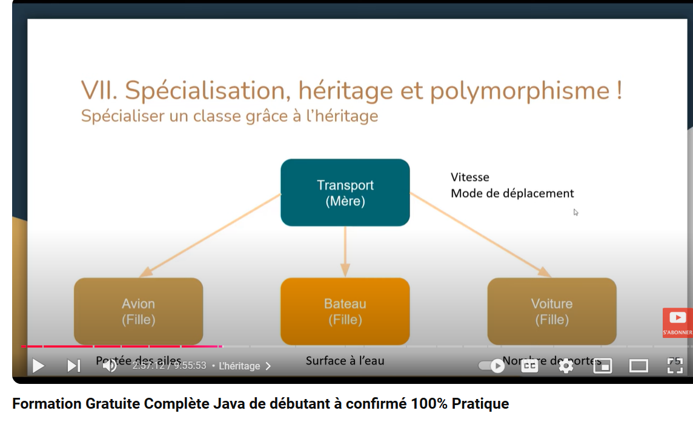

3-POLYMORPHISME:
 
    Lorsqu'une classe fille herite des methodes de la classe mere alors elle herite aussi des attributs et comportement de la classe mere.
     exple:le transport se deplace
            l'avion vole
            la voiture roule
            le bateau glisse

      POLYMORPHISME:  POLY pour plusieurs et MORPHISME pour forme.
     On pourra appeler la methode deplacer sur la classe mere et le bon comportement sera declencher.

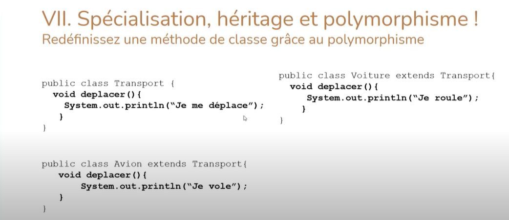 

DEMONSTRATION:Essayons nous a l'heritage et au polymorphisme

     En java, toutes les classes sont des classes specialisantes d'une classe java.lang.Object
      Super: permet de referencer la classe mere(Vehicle)

      Heritage = est la consequence de la specialisation(j'herite des donnees de la mere parce que je specialise cette classe mere) et ca fait gane en temps et de flexibilite.
       Avec la specialisation on aquiere la posibilite de redefinir le comportement de la classe mere dans la classe fille(polymorphisme)

LES CONDITIONS:

       En programmation on execute pas toutes les lignes que nous tapons dans le code.
     Un programme: est un ensemble de lignes de codes qui s'executent l'une apres l'autee, certaines a plusieurs reprises via des boucles,certaines sont sautees/executees selon des conditions.
     Une condition petmet d'effectuer une action ou pas selon qu'elle soit vraie ou fausse

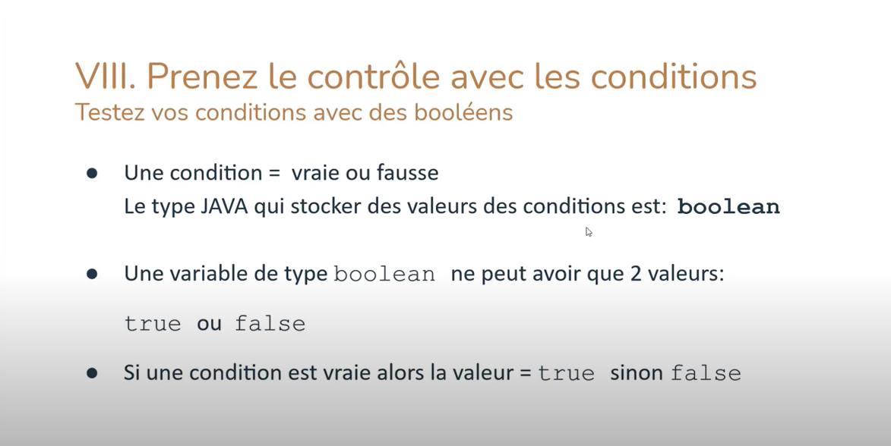

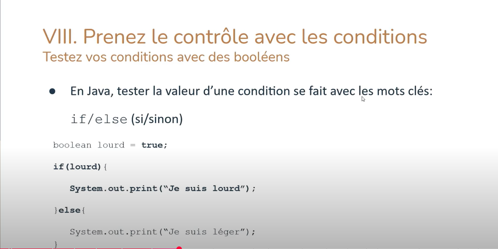

      les comparaisons entre valeurs produisent des booleens(egal,superieur,inferieur, different)
     Les Operateurs de comparaison:
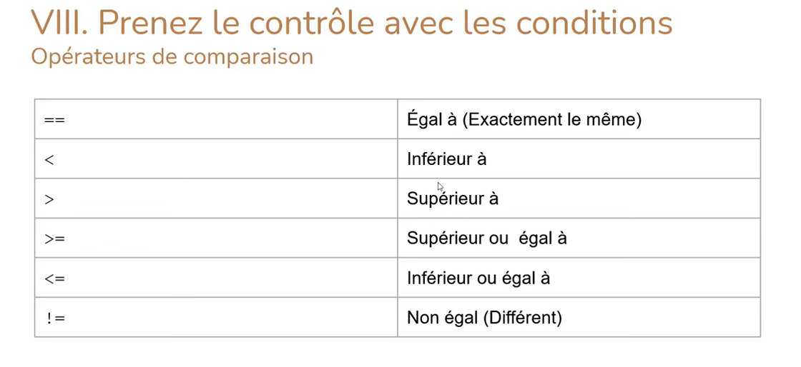

     la Combinaison de valeurs booleennes produisent des booleens.
       la combinaison se fait grace aux operateur logique.
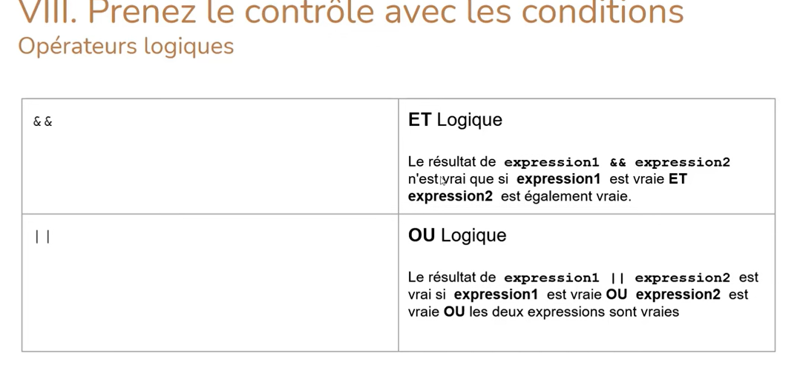 
exemples: 

 true && true && true // -> true

 true && true && false // -> false

 true || false || false // -> true

 false || false || false // -> false

 false || true && true // -> true

 !false && true || false // -> true

l'operateur d'inversion ! est prioritaire, puis operateur ET && et enfin, l'operateur OU ||

 (true && false) || true // -> true

 !(true && false || !true) // -> true
Utilisez les parentheses() pour changer l'ordre!

On peut faire face a des situations ou deux alternatives ne sont pas suffisantes: 

    exple: Test sur plusieurs tranches d'ages
           Moins de 18 ans
           Entre 18 et 30 ans
           Plus de 30 ans
    Il faut penser "Chaine de conditions"
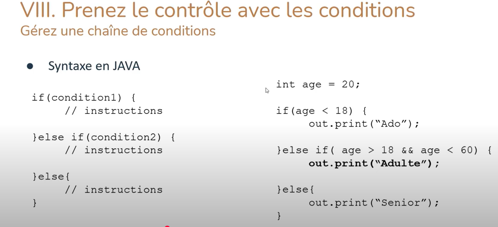

Trop de conditions a tester?

    Enchainer des If/else devient vite illisible; exple: Les plats d'un menu: Ndole,Mafe,Thieb,Quiche,Raclette ...
    Ideal pour trester des valeurs precises! est d'utiliser:  Switch

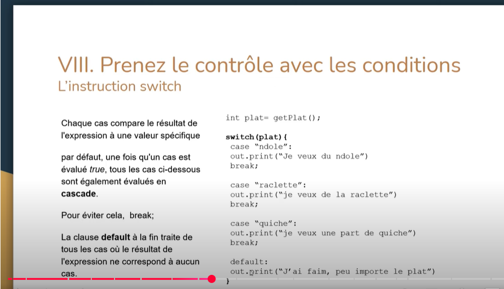

 Demonstration de l'utilisation des conditions :

           If/else
           Switch
           Enumeration: est un ensemble de valeurs precises qui pouront etre utiliser dans plusieurs classes.
    Exple: bleu, blanc, rouge,violet ...

RESUME:  

    Les conditions vous permettemnt d'executer un bloc de code uniquement si une valeur booleen, une valeur booleen,
           une variable ou une expression evalue a true.(la methode equals de type String retourne un booleen)
    Les expressions conditionnelles les operateurs de comparaison et les operateurs logiques
    Vous pouvez evaluer plusieurs conditions en creant des chaines d'instructions if/else if/else
    L'instruction switch est une facon propre d'executer en fonction des differentes valeurs possibles d'une 
           condition particuliere.
    Les enemerations vous permettent de definir un ensemble de valeurs possibles pour rendre le code encore 
            plus propre.(pour bien gerer les erreurs)

TABLEAUX,LISTES ET DICTIONNAIRE:
Gestion un grand nombre de donnees avec des tableaux, listes et dictionnaire:
Utiliser un tableau pour un nombre fixe d'elements
    

           Un Tableau: est une liste ordonnee numeriquement d'elements du meme type(soit uniquement des voitures,soit uniquement des telephones,soit uniquement des entiers, soit uniquement des doubles....);
                      Il permet de stocker un nombre de donnees fixe et connu.
       Exple: un ensemble de plusieursobjets a gerer: 10 voitures a immatriculer
          le nombre de voitures est connu et nechangera pas: il faut stocker dans un tableau

     Pour acceder aux differents elements du tableau on utilise les index(est la position a laquelle se trouve un element du tableau dans le tableau)

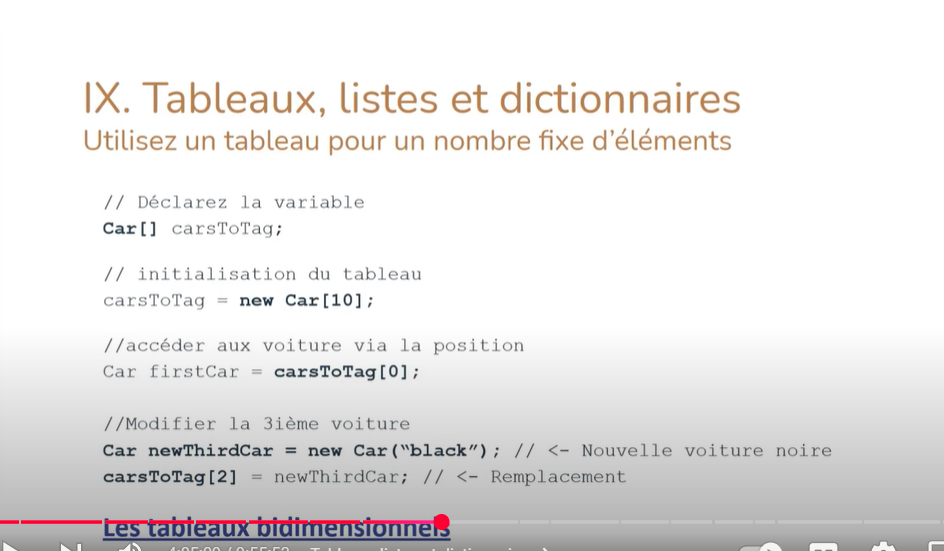

     Une liste: represente un tableau que l'on peut modifier(ajouter,inserer,supprimer des elements) peut etre ordonnee ou non
     En java, toutes les classes implementant l'interface List sont des listes; les incrementations de ses classes sont: ArrayList, LinkedList, Vector.

     Un interface: est une classe 100% abstraite qui a bespin d'etre implementer par une classe afin de la concretiser.
     Une classe abstraite: est une classe qui contient au moins une methode abstraite
     Une methode abstraite: est une methode qui n'a pas de corps donc sans implementation du comportement
                       interface Vehicule{
                           public void more();
                           public void goback()
                       }
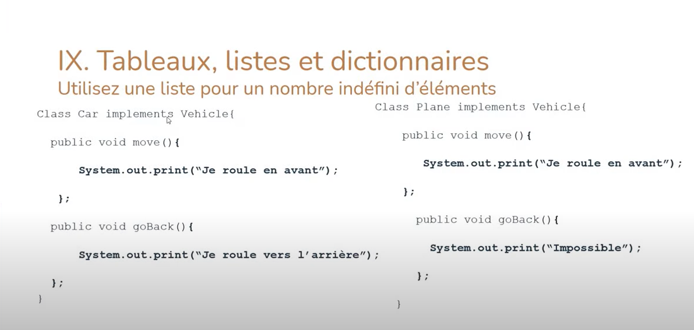

ArrayList(list Ordonnee)
  declaration d'une liste en java:

       List<Integer> maListe = new ArrayList<Integer>();
                   Integer: Type d'elements dans la liste
                   maListe: Nom de la variable contenant la liste
                   ArrayList: Type de la liste
     
       Pour nourrir la liste il y'a plusieurs methode qui existe a savoir:
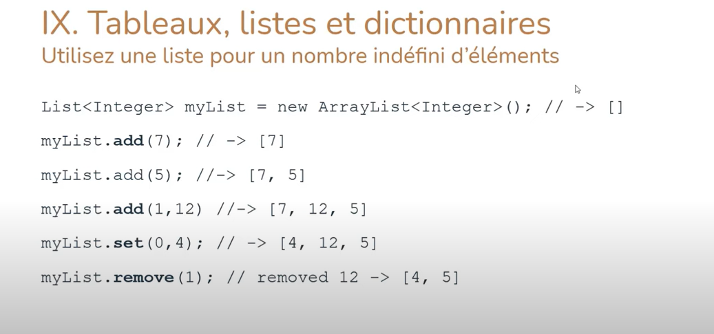

     Si l'on ne se soucie pas de l'ordre, utiliser: une collection d'elements uniques non ordonnes.
      En java, toutes les classes implementant l'interface Set sont des listes non ordonnees.
       HashSet, LinkedHashSet, TreeSet
       HashSet: est la collection la plus commune.
La facon de declarer un Set:

       Set<String> ingredients = new HashSet<String>();

         String = Type d'elements dans l'ensemble
         ingredients = Nom de la variable contenant l'ensemble
           HashSet = Type d'ensemble
Ajout d'un element dans la liste:

     Set<String> ingredients = new HashSet<>();

       ingredients.add("salt");
      //ajoutez du sel parmi les ingredients

       ingredients.remove("salt");
      //enlevez du sel des ingredients

Dictionnaires ou "Maps"
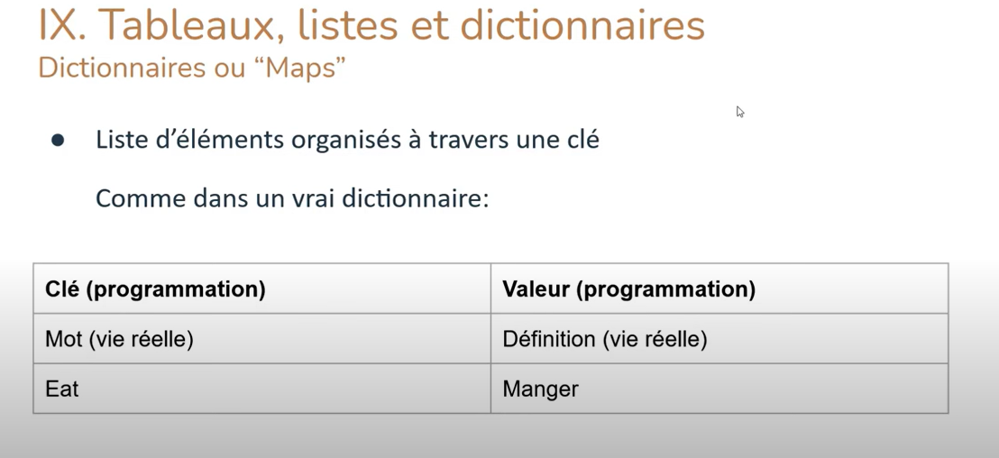
      Les cles du dictionnaire doivent etre uniques:
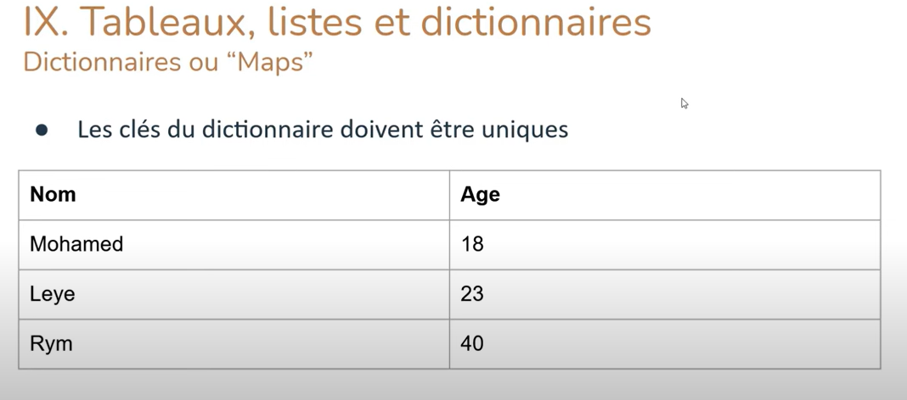

    En java, toutes les classes implementant l'interface Map sont des dictionnaires.
        HashMap, LinkedHashMap, TreeMap
     HashMap: est la collection la plus commune.
La facon de declarer un Map:

    Map<String,Integer> myMap = new HashMap<String, Integer>();
      
      String = Type de cle
     Integer =  Type de valeur
     myMap = Nom de la variable contenant le dictionnaire
     HashMap = Type de dictionnaire
exemple de Map:
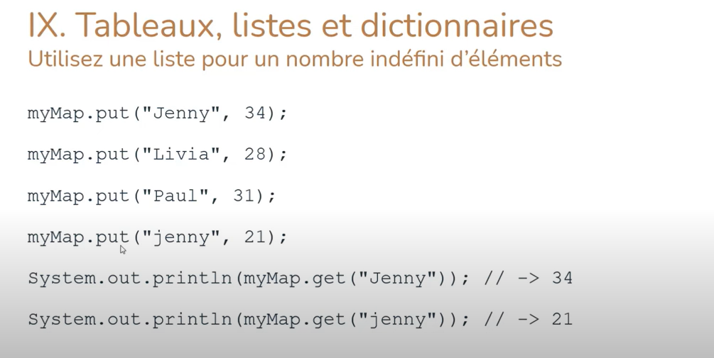

Demostration: utilisation des conditions:
     
     Manipuler un tableau
     Manipuler une liste
     Manipuler une collection non ordonmnee
     Manipuler un dictionnaire

Note: size:est la methode qui permet de recuperer la taille d'une liste
        length: est l'attribut qui permet de retourner la taille d'un tableau
      
        Ctrl+q: pour voir la documentation d'une methode
        difference entre une liste et un set est que la liste est ordonne et le St est non ordonnee

Resume: 

    *Conteneur de taille fixe: Arrays-les elements d'un tableau sont indexes a partir de 0 et sont accessibles a l'aide de cet index. Le nombre d'elements ne peut pas etre modeifie.
    *Listes ordonnees: Lists-les elements d'une listes se comportent comme un tableau.le nombres elements peut evoluer en ajoutant et en supprimant des elements
    *Listes non ordonnees: Sets-les elements d'un ensemble sont stockes sans ordre particulier, vous pouvez y acceder en les numerant.
    *Dictionnaire: Maps-les elements d'un dictionnaire sont organises par paires cle-valeur et sont accessibles a l'aide d'une cle.

Gestion des differents types de passage en parametre

Exemple:
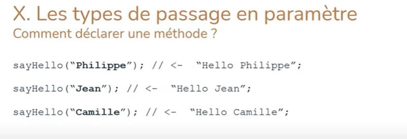
Definition d'une valeur de retour
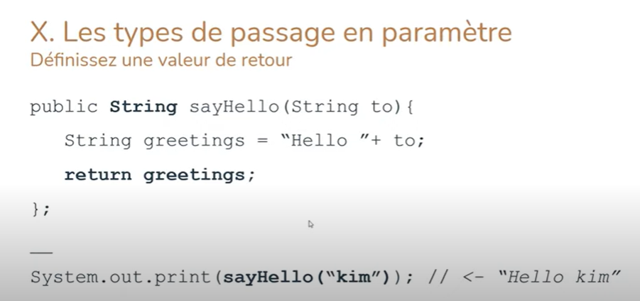
Differenciez les types de valeur et de reference:
    
    . Variables de type valeur:
      Si on l'on cree une variable,puis on l'affecte une  autre variable
      La valeur  de la premiere variable sera copiee dans la seconde  variable.
      ex: les variables de type primitifs(int,float,boolean) sont de type valeur
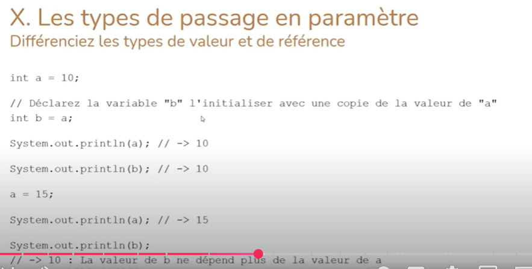

     . Variables de type reference:
        Si on l'on cree une variable et lui affectons une instance de classe,
        l'objet est cree, mais la variable elle meme contient une reference a cet objet:
        l'emplacement ou il est stocke dans la memoire.
        Variable->Adresse->Objet en memoire
exemple:
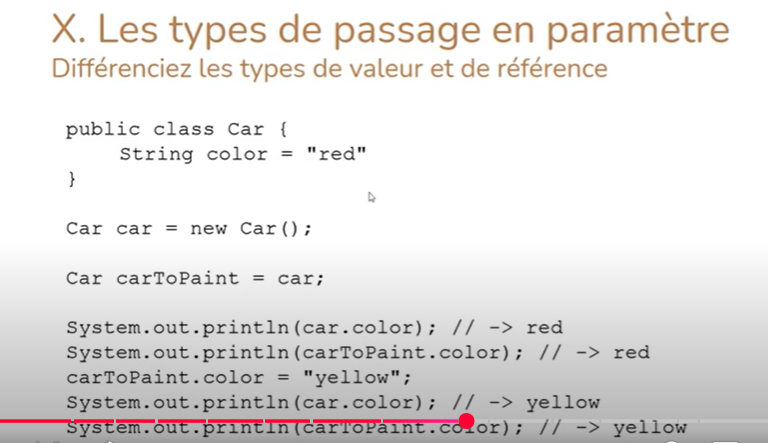

Les types d'objets qui respectent les passages par reference sont de type Class c-a-d integer, Double, string,ticket, car....etc
NB: si vous passez des types classe en tant que  parametre, toutes les notifications que vous allez effectuer sur eux dans ses fonctions modifiront les objets originaux

Demonstration:  Passons en parametre les 2 types: type valeur et type reference

Resume:

     *Les fonctions peuvent avoir des parametres et des valeurs de retour(return);
     *une valeur de retour est le resultat de l'execution de la fonction;
     *Les parametres sont les entrees d'une fonction necessaires a l'execution;
     *Les parametres sont des variables definies par leur nom et par leur type. Ces parametres sont specifies dans la declaration de la fonction;
     *Lorsque vous appelez une fonction,jvous passez des valeurs a ces variables.Ces valeurs sont appelees arguments.
     * Par valeur: types primitifs | par "reference"(pas vraiment): types non-primitifs

La Recursivite:

la fonction factorielle en java:
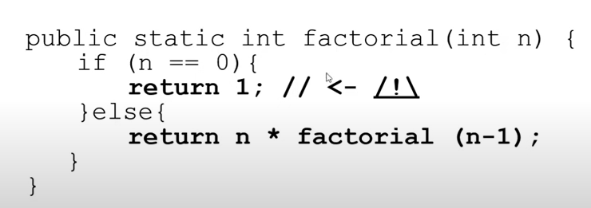

Demo: Explorons une structure en couche
   
      . Un exemple de recursivite

Resume :
   
    La recursivite est une action qui s'initialise a l'interieur d'elle meme a partir d'une condition et qui par la suite va s'appeller elle meme par la suite jusqu'a ce que la condition soit remplie
    Les methodes recursives servent a passer des structures en couches

GESTION DES COMPORTEMENTS INATTEDUS AVEC LES ERREURS ET LES EXCEPTIONS:
               ERREURS ET EXCEPTIONS

Qu'est ce qu'une erreur:

   * Les programmes sont ecrits par des etres humains
   * l'erreur est humaine
   * Quelques erreurs:
          fautes de frappe
          mauvaise utilisation des variables
          logique du programme
   * Erreur de COMPILATION: code -> langage machine(erreurs de syntaxe du langage)
   * Erreur D'EXECUTION -> execution du code machine(logique du programme)
   * Lorsqu'une erreur est detectee, le programme emet une exception
   * une exception: est un evenement qui interrompt le deroulement prevu d'un programme.
          
Reperez et corriger les erreurs de compilation:

      elles se fait:
        * avec la commande javac(java Compiler)
        * avec l'IDE

Gerez les erreurs d'execution

   * Aucun moyen de detecter ces erreurs pendant la compilation 
     Acceder a un element d'une liste dont l'index est superieur a la longueur de cette liste
   * Elees peuvent causer un arret complet de l'application: CRASH
   * Que faire? Deboguer ou prevoir les exceptions

Recherchez les erreurs:

      Le Debogage: Suivre le programme ligne par ligne et a observer l'etat des variables dans l'environnemnt de developpement.
gerez les exceptions:
    
       *Prevoir une exception
           Mettre en place une action pardefaut en cas d'erreur.
etapes

        Essayer un code qui pourrait emettre une erreur 
        Capturer l'erreur au cas ou
        Rediriger le programme vers des lignes de code alternatives afin d'eviter le crash de l'application

  
Demo:  Creons des erreursp

      *Debogage
      *Gestion des exceptions evc try/catch